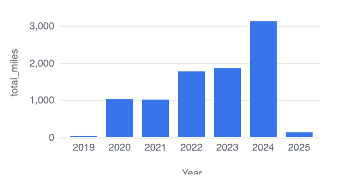
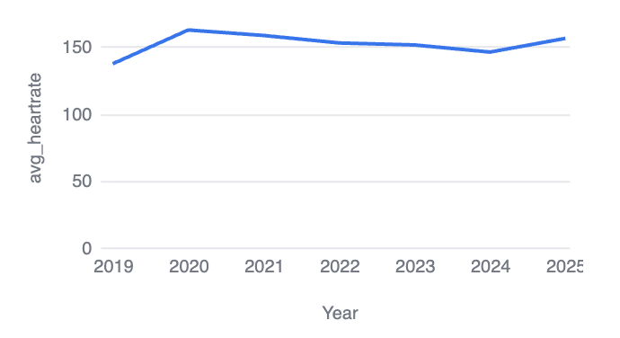
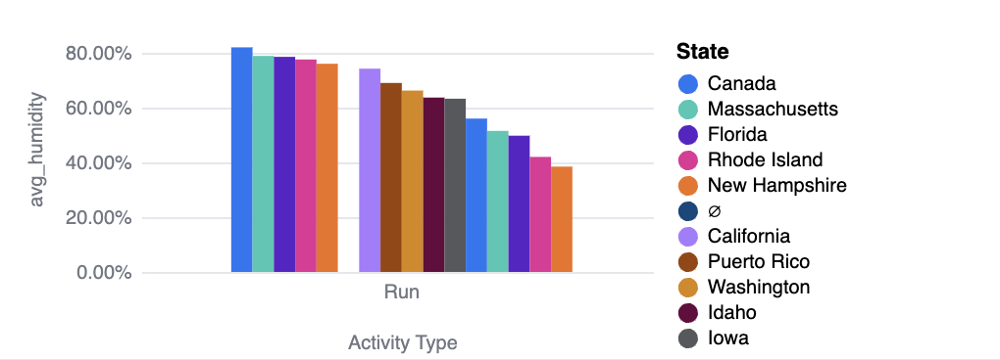
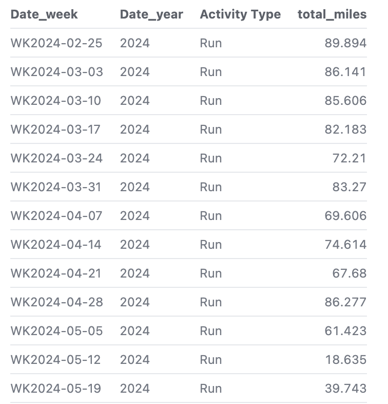
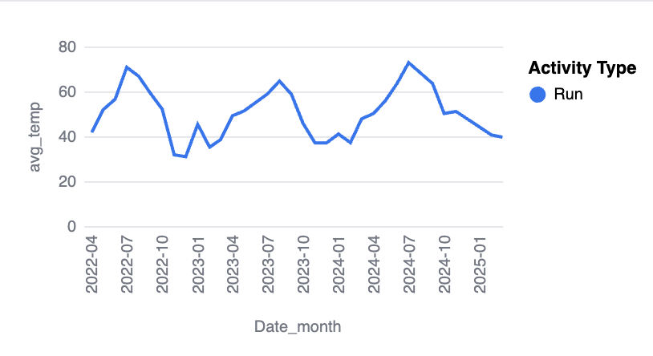
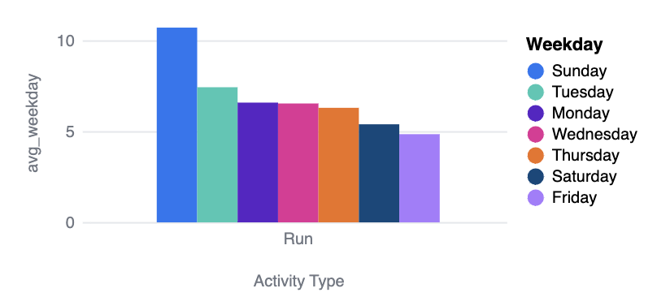

# Strava Data 2019-2025

## Overview
Running has been an integral part of my life since 2014, shaping my training, discipline, and overall fitness journey. This project analyzes my Strava activities between 2019 and 2025, offering a comprehensive look at my progress, training patterns, and insights gained over the years. Unfortunately, I do not have access to my runs prior to 2019, as they were not recorded on my running watch, but I aim to make the most of the available data.

This was my favorite project of the semester, as it allowed me to blend my passion for running with data analysis. I was particularly excited to explore trends in my training, including mileage progression, performance across different climates, and correlations between high-mileage weeks and injury risks. I also had a strong interest in analyzing activity start times throughout the year, which I plan to explore further in future iterations of this project.

Beyond my personal training, I have begun exporting data from my teammates and family members to uncover additional insights. Moving forward, I hope to integrate sleep data and external factors to better understand their impact on my running performance.

This project focuses on various key metrics, including total miles, average heart rate, average pace, elevation gain, and temperature. Additionally, I frequently compare my 2023 Cross Country Season to my 2024 Cross Country Season, along with insights into my 2024 Spring Track Season.

## Key Insights
### 1. Total Miles by Year
- My total mileage has increased significantly over the years, peaking in 2024. 
- There is a clear trend of progression, reflecting improved consistency and volume in training.

### 2. Running Across the U.S.
- A heatmap of total miles run per state highlights my running distribution across the country.
- My mom’s goal is to run in every state, and she was particularly excited to see this visualization.
- As expected, most of my miles have been logged on the East Coast, as I grew up in Rhode Island before moving to New Hampshire.

### 3. Average Heart Rate Over Time
- My heart rate data shows a relatively stable trend, with a slight decrease after 2021.
- This may indicate improved endurance and efficiency over time.
- My heart rate has gone down over time, but my sample size in **2019 and 2025** is not large enough to draw strong conclusions.

### 4. Humidity Levels During Runs
- I ran in some of the most humid states, including Florida, Massachusetts, and Rhode Island.
- Understanding humidity levels can help me analyze performance in different climates.

### 5. Weekly Running Volume
- Examining my highest-mileage weeks, I found that I consistently surpassed **80+ miles per week** during peak training blocks.
- Identifying these high-mileage weeks is crucial for evaluating training effectiveness and potential injury risks.
- During this period, I was training for a **10K race**, which requires a strong aerobic base, making high mileage essential for endurance and race performance.

### 6. Temperature Fluctuations During Runs
- My training conditions vary significantly by season, with average temperatures peaking in summer and dropping sharply in winter.
- A notable dip in early January 2024 highlights particularly cold training conditions.

### 7. Running by Day of the Week
- Sundays have the highest average mileage, likely due to long runs.
- Weekday mileage is more evenly distributed, with slight variations.
- Weekly mileage does not include **daily doubles**, but rather an average of two runs. This means that the reported mileage is **twice as high on Mondays, Wednesdays, and Fridays**, when double sessions are typically scheduled.

## Conclusion
This project provided valuable insights into my training, highlighting trends in mileage, heart rate, temperature, and geographic distribution. I plan to continue refining my analysis, particularly focusing on injury-prone training blocks and race preparation strategies. I also aim to incorporate sleep data and external factors affecting performance.

I am excited to expand this analysis further, including comparing my teammates’ and family members’ training data. Strava has been an incredible tool for tracking my progress, and I look forward to leveraging this data for future improvements in my running performance.
